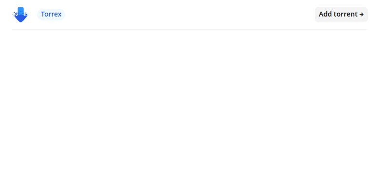

# Torrex

A small BitTorrent client written in Elixir.
You can read the [blog post](http://kochika.me/posts/torrent) for more information.

To start your Phoenix server:

- Run `mix setup` to install and setup dependencies
- Start Phoenix endpoint with `mix phx.server` or inside IEx with `iex -S mix phx.server`

Now you can visit [`localhost:4000`](http://localhost:4000) from your browser and add the torrent you want to download.

## Limitations

- Doesn't support magnet links
- Doesn't seed
